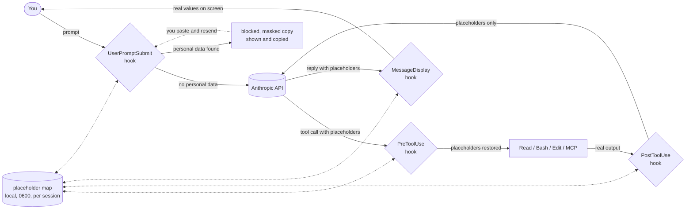

# pii-mask

Claude Code plugin that keeps personal data on your machine. It masks emails, phone numbers, card numbers, IBANs, Turkish national IDs and US SSNs before they reach the model, and restores them where they are needed.


The demo feeds real hook payloads through the plugin. Re-record it with `asciinema rec --window-size 132x14 -c "bash demo/run.sh" demo/demo.cast && agg --theme dracula --font-size 14 demo/demo.cast demo/demo.gif`.

## How it works



Everything left of the API box runs on your machine. The API only ever sees placeholders.

## Hooks

| Hook | What happens |
| --- | --- |
| `UserPromptSubmit` | Prompt contains personal data → it is blocked before sending, and a masked copy is shown (and put in your clipboard on macOS). Paste and resend. |
| `PostToolUse` | Tool output (file reads, shell output, grep, MCP results) is masked before the model sees it. |
| `PreToolUse` | Placeholders in tool inputs (edits, writes, commands) are restored, so edits match real file content and commands run with real values. |
| `MessageDisplay` | Placeholders in Claude's replies are restored on screen. The transcript keeps the placeholders. |
| `SessionEnd` | The placeholder map for the session is deleted. |

Names and addresses are found heuristically, in English and Turkish: labels (`name:`, `"firstName":`, `address:`, `adres:`), titles (`Dr.`, `Mr.`, `Sayın`), conversational cues (`I am John Smith`, `my name is`, `Regards,`, `Benim adım`), US and UK street shapes (`123 Main St, Springfield, IL 62704`, `221B Baker Street, London NW1 6XE`), Turkish shapes (`Atatürk Mah. Cumhuriyet Cad. No:12 D:3 Kadıköy/İstanbul`), and names derived from masked emails (`ali.yilmaz@` also masks `Ali Yılmaz`). Phone formats cover international `+..`, US `555-123-4567` and `(555) 123-4567`, UK `07700 900123` and Turkish `0532 123 45 67`.

Placeholders look like `__PII_EMAIL_3f9a1c__`. The suffix is a hash of the value, so the same value always maps to the same placeholder and the map self-heals after a resume: re-reading a file recreates it.

Card numbers are Luhn-checked, IBANs mod-97-checked and TCKNs checksum-checked to keep false positives low. The map lives in the plugin's data directory as a `0600` file, one per session.

## Install

```
/plugin marketplace add serkankorkut/pii-mask
/plugin install pii-mask@pii-mask
```

Requires Node.js 18+ on `PATH`. To try it from a checkout:

```
claude --plugin-dir /path/to/pii-mask
```

## Test

```
node test.js
```

## Prove it

Do not take the README's word for it. `demo/prove.js` starts a fake Anthropic API on localhost, points the real `claude` binary at it with `ANTHROPIC_BASE_URL` and a fake key, drives two sessions and records every byte Claude Code sends:

1. A prompt containing an email. Expected: the hook blocks it and the fake server receives zero requests.
2. A prompt asking to read `demo/customers.csv`. The fake model answers with a `Read` tool call, Claude Code runs it for real, and the next request carries the file content. Expected: only placeholders, none of the names, emails, phones or addresses from the file.

```
node demo/prove.js
```

Same binary, same plugin, same hooks; only the model is fake. The captured request bodies are exactly what would have gone to Anthropic. If you prefer your own instrument, point `ANTHROPIC_BASE_URL` at mitmproxy or any logging proxy and read the traffic yourself.

## Limits

- Name and address detection is heuristic. A bare name in free text with no label, title or matching email nearby passes through, and labels like `name:` can catch non-person values. An NER model is the upgrade path.
- Images and pasted files are not inspected.
- Prompts cannot be rewritten by hooks, so a prompt with personal data has to be resent in masked form.
- Bash hooks see tool output, not the raw API request. If you need a hard guarantee, run a masking proxy and point `ANTHROPIC_BASE_URL` at it.

## Technical details

**Hooks are child processes.** Claude Code runs `hooks/mask.js` once per event, with a JSON payload on stdin. The script prints a JSON decision on stdout, or nothing to leave the event alone. There is no daemon, no network listener and no dependency beyond Node.js.

**Six events, one script.** `hooks/hooks.json` registers the same command for `SessionStart`, `UserPromptSubmit`, `PreToolUse`, `PostToolUse`, `MessageDisplay` and `SessionEnd`; the script switches on `hook_event_name`.

- `UserPromptSubmit` receives `prompt`. Hooks cannot rewrite a prompt, only allow or block it, so on a hit the script returns `decision: "block"` with the masked text in `reason`. Nothing is sent. On macOS it also runs `pbcopy` so the masked copy is ready to paste.
- `PostToolUse` receives `tool_response`, whatever shape the tool uses. The script walks every string in it, masks, and returns the same structure as `hookSpecificOutput.updatedToolOutput`. Claude Code sends that to the model instead of the original.
- `PreToolUse` receives `tool_input`. Every placeholder in it is swapped back to the real value and the result is returned as `hookSpecificOutput.updatedInput`, so an `Edit` matches the real file and a `Bash` command runs with real arguments.
- `MessageDisplay` receives each streamed `delta` of the assistant's text. Placeholders are swapped back in `displayContent`. Only the screen changes; the transcript and the model keep the placeholders.
- `SessionStart` prints one line of context telling the model that `__PII_*__` tokens are opaque literals to copy verbatim.
- `SessionEnd` deletes the session's placeholder map.

**Detection is an ordered list of patterns.** Each entry is a type, a regex and an optional validator. Emails go first so their digits are not later mistaken for phones; cards, IBANs and Turkish IDs run before phones for the same reason. Validators cut false positives: Luhn for cards, mod 97 for IBANs, the two-digit checksum for TCKN. Label, title and cue patterns capture only the value, and a shape check (`personLike`, `addressLike`) rejects things like `name: pii-mask` or `address: 0x7fff`. After the static pass, the local part of every masked email is split into tokens and each token is masked wherever it appears capitalized or in all caps, accent-insensitively, so `ayse.yilmaz@` also hides `Ayşe` and `YILMAZ` in a CSV column.

**Placeholders are content-addressed.** A value becomes `__PII_<TYPE>_<first 6 hex of sha1(value)>__`. Because the token is derived from the value, the same email produces the same placeholder in a prompt, a file read and a grep result without any lookup, two hooks running in parallel cannot disagree, and after a resume a single re-read rebuilds the map. Underscores keep the token a single word for the model and syntactically harmless inside code.

**The map is a local append-only file.** Placeholder to value pairs are appended as JSON lines to `$CLAUDE_PLUGIN_DATA/<session_id>.jsonl`, created with mode `0600`. Appending small lines is atomic on POSIX, which is why parallel tool calls never lose an entry. The file is deleted at `SessionEnd`.

**What still leaves the machine.** Placeholders, everything the patterns do not recognize, file paths, and your prompt once you resend it in masked form. Detection is regex and heuristics, not a model; a name in free text with no label, title, cue or matching email nearby will pass through. Run `node demo/prove.js` to see exactly what goes out.